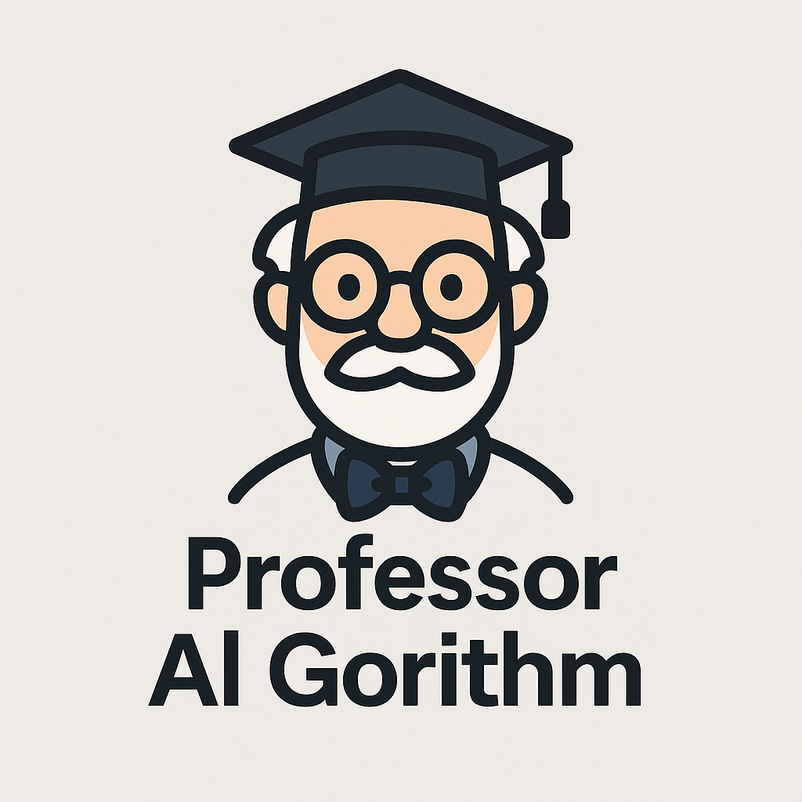

# Professor Al Gorithm - Virtual Data Structure and Algorithm Tutor



This is based off of the Topcoder challenge - [Learn AI – Build and Deploy](https://www.topcoder.com/challenges/355a5497-71c3-4e3a-b200-f53d62564667?tab=details) and [Hugging Face MCP Course](https://huggingface.co/learn/mcp-course/unit0/introduction#welcome-to-the--model-context-protocol-mcp-course)

AI agent that helps guide you through solving a coding problem following the [Algorithm Design Canvas](https://www.hiredintech.com/algorithms/algorithm-design-canvas/what-is-the-canvas/). The professor will guide you through the steps to solve the problem as if you were doing a whiteboard coding interview. The steps taken will be based on:

- Constraints
- Ideas
- Test Cases
- Code

The professor will not supply you any code throughout the process. No matter what language you are using, the professor will guide you through the steps to solve the problem. The professor will not write any code for you, but will help you think through the problem and come up with a solution. Rather than give you the code, you will be taught how to write it yourself.

## Core Concept & Algorithm Design Canvas

The Algorithm Design Canvas is a structured approach to solving coding problems, particularly useful for whiteboard interviews. The canvas consists of four main steps:

1. **Constraints** - Define the problem space, input/output formats, and performance requirements
2. **Ideas** - Brainstorm and evaluate different solution approaches
3. **Test Cases** - Create comprehensive test cases to validate the chosen approach
4. **Code** - Implement the solution structure and validate against test cases

## The Model Context Protocol

What the professor needs to perform:

- Maintain **step-by-step structure** (Constraints -> Ideas -> Test Cases -> Code).
- Enforce a **teaching style** (e.g., Socratic questioning, no code-writing).
- Remember **prior answers**, like constraints already gathered or test cases discussed.
- Adapt to **user skill level or struggle** (e.g., repeat steps, prompt hints).

### Key MCP Elements

#### System Instructions (Agent Persona)

The tone, rules, and scope of the professor's responses. This includes:

```yaml
system_instruction:
  - You are a professor teaching algorithms for whiteboard interviews.
  - Your role is to guide students through problem solving using the Algorithm Design Canvas.
  - You never write code; instead, ask questions, guide thinking, and help the student formulate their own solution.
  - You are structured and Socratic. Always ask follow-up questions before revealing too much.
  - You follow the steps: Constraints → Ideas → Test Cases → Code Structure.
```

#### Structured Workflow via Steps

The MCP stages based on the canvas:

```yaml
context_stages:
  - name: constraints
    goal: Help the user define all important input/output constraints, performance needs, and edge cases.

  - name: ideas
    goal: Brainstorm candidate strategies based on constraints. Ask guided questions about brute force, optimizations, etc.

  - name: test_cases
    goal: Help the user construct meaningful test cases to validate their ideas, including edge cases and big inputs.

  - name: code
    goal: Prompt the user to sketch code structure in pseudocode. Ask if they need help validating flow or logic.
```

MCP keeps the model **anchored in each phase** and allows transitions only when the current step is complete. This prevents skipping steps or jumping ahead.

#### Dynamic Memory Management/Context

Capture and reuse user answers:

```yaml
dynamic_context:
  - constraints_summary: "Input is a list of integers. Output is the max sum of any contiguous subarray."
  - ideas_discussed: ["brute-force with nested loops", "Kadane's algorithm"]
  - test_cases_created: ["[1, 2, 3, -2, 5]", "[-1, -2, -3]", "[5]"]
```

This memory allows the professor to reference past discussions, ensuring continuity and relevance in guidance.

### Transition Criteria for Each Canvas Step

#### Constraints -> Ideas

**Goal**: Ensure the problem space is well-defined before thinking of solutions.
**Transition Criteria**:

- User has identified:
  - Input format(s) and types (e.g., integers, strings)
  - Output format(s) and types (e.g., integer, boolean)
  - Constraints on size (e.g., `1 <= n <= 10^5`)
  - Time/space complexity requirements (e.g., O(n log n) or O(n^2))
  - Edge cases (e.g., empty input, single element)

**Model prompt to check readiness**:

> "Can you summarize the constraints we've discussed? What are the key inputs and outputs we need to consider?. Once we have confirmed that, we can explore potential solution ideas."

#### Ideas -> Test Cases

**Goal**: Ensure the user has a solid understanding of potential solution strategies before validating them with test cases.
**Transition Criteria**:

- User has considered:
  - At least one brute-force approach
  - At least one optimized approach
  - Any potential edge cases or special conditions
  - Trade-offs discussed (e.g., time vs space complexity)
  - Rejected at least one idea with reasoning
  - Chosen one cadidate solution to explore further

**Model prompt to check readiness**:

> "What solution strategies have we brainstormed? Can you summarize the pros and cons of each? Once we have a clear candidate, we can start constructing test cases to validate it."

#### Test Cases -> Code

**Goal**: Validate that the chosen idea behaves correctly on concrete inputs.
**Transition Criteria**:

- User has written at least:
  - A "happy path" test case that covers normal input
  - An edge case (e.g., empty input, maximum size)
  - A boundary case (e.g., smallest/largest possible input)
- For each case, the expected output is clearly defined.
- The chosen approach has been mentally run against the test cases to ensure it should work.

**Model prompt to check readiness**:

> "Can you list the test cases we've created? What are the expected outputs for each? Once we have a solid set of test cases, we can start sketching out the code structure to implement our solution."

#### Code -> Exit/Reflection

**Goal**: Help the user pseudo-code or outline structure, and reflrect on what they learned.
**Transition Criteria**:

- User has written or described:
  - Input handling (e.g., reading input, parsing)
  - Core logic structure (e.g., loops, recursion, DP table)
  - Output handling (e.g., printing results, returning values)
- The structure aligns with the chosen idea and passes all test cases.

**Model prompt to wrap up**:

> “Great work. You’ve translated your idea into a solution sketch. Before we wrap, would you like to discuss possible optimizations or revisit any test cases?”

### Detecting When the Student is Stuck

A student can get stuck in several ways, such as:

- Giving **repetitive answers** (e.g., "I don't know" or "I'm not sure").
- Asking **vague questions** (e.g., "How do I solve this?").
- Remaining **silent or giving minimal responses** like "idk" or "yes/no".
- **Jumping to code prematurely** without fully exploring constraints or ideas.

#### Detection Strategies

- **Keyword/phrase detection**: Monitor for phrases like "I don't know", "I'm not sure", or "I need help".
- **Low-quality responses**: Identify when the user gives minimal or repetitive answers. Example is the user says, "I'll just use a loop" without defining input/output first.
- **Progress stalls**: Track when the **same question is asked multiple times** without progress, indicating the user is stuck.
- **Sentiment/uncertainty analysis**: Use NLP techniques to detect frustration or confusion in user responses.

### Handling Stuck Students

When the professor detects a student is stuck, it can:

- Provide **hints or leading questions** to guide the student towards the next step.
- Encourage the student to **rephrase their question** or explain their thought process.
- Use leading Socratic questions to help the student clarify their understanding.
- Suggest the student **break down the problem** into smaller, more manageable parts.
- Provide a **gently nudge** by offering suggestions like, "Let's revisit the constraints we discussed. Can you think of any edge cases we might have missed?" or "What if we tried a different approach to the problem?"

### Allowing Skips (with Guardrails)

Sometimes the student may want to skip a step, such as jumping from constraints to code. The professor can allow this but with guardrails:

- **Confirms the intent**: "I see you want to jump to code. Can you summarize the constraints and ideas we've discussed so far?"
- **Persist partial context**: If the student skips, the professor should still remember what was discussed in the skipped step.
- **Offer a fallback reminder**: While in later stages (e.g., coding), remind them of the importance of the skipped step: "Remember, we discussed edge cases in constraints. Have you considered how your code will handle those?"

### Proactive Support Strategies

- After **X seconds of silence or very short answers**, the professor can offer a nudge: "It seems like you might be stuck. Would you like to revisit the constraints or brainstorm some ideas together?"
- Add a **"skip" keyword detection**: If the user types "skip" or "let's move on", the professor can respond with: "I understand you want to move forward. Can you summarize what we've discussed so far in terms of constraints? This will help us maintain context as we proceed."

### Example Interaction Flows

**Constraints Stage Example**:

1. Ask: "What are the constraints for this problem?"
2. User: "I don't know."
3. Professor detects confusion (keyword "don't know").
4. Professor responds: "No problem! Let's break it down. What kind of input do you expect? Can you describe the data types or sizes we might encounter?"
5. If user continues to struggle, the professor can suggest: "Let's think about some common constraints for similar problems. For example, if we were dealing with a list of integers, what would be the minimum and maximum sizes we should consider?"

### Session Reflection and Wrap-up

If the steps were skipped, provide a **wrap-up prompt** to reflect on what was learned:

> "Before we finish, let's reflect on what we've covered. Can you summarize the constraints, ideas, and test cases we discussed? How do you feel about the solution structure we outlined? Is there anything you would do differently next time?"

## System Architecture

### Frontend Components

- A simple web interface where users can interact with the professor.
- Input fields for problem statements, constraints, ideas, and test cases.
- Display area for the professor's responses and guidance based on The Algorithm Design Canvas.
- WYSIWYG editor for code sketching.

### Backend Services

- Agent orchestration that loads the MCP and manages the conversation flow.
- Claude AI model that processes user inputs and generates responses based on the MCP.
- Context includes static prompt + dynamic memory management to maintain continuity.

### Storage Layer

- Store user sessions, problem statements, constraints, ideas, test cases, and code sketches.
- Use PostgreSQL to persist user progress and allow resuming sessions.

### Future Enhancements

- **Personalized hints**: Track when a user struggles and provide tailored hints or examples without giving away the solution.
- **Feedback summaries**: Let the professor summarize key takeaways after each session.
- **Reflection questions**: Ask users to reflect on their learning after completing a problem.
