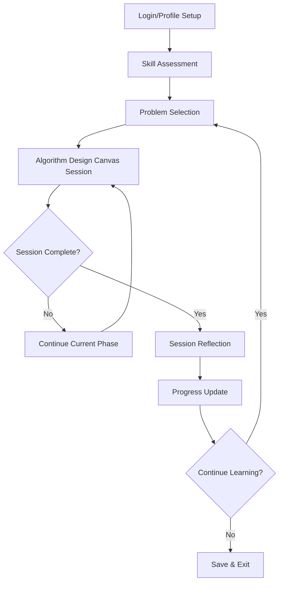

# Use Case Document

## Professor Al Gorithm - Virtual Data Structure and Algorithm Tutor

---

## 1. Problem Definition

### Real-World Problem

**Technical interview preparation lacks structured methodology for algorithmic thinking.** Current platforms and resources suffer from critical gaps:

- **Solution-focused rather than process-focused**: Most platforms give answers instead of teaching problem-solving methodology
- **Lack of structured guidance**: Students jump to coding without proper analysis phases
- **No adaptive teaching**: One-size-fits-all approaches don't adapt to individual learning patterns
- **Missing Socratic methodology**: Students receive direct answers rather than guided discovery

### Why This Matters

- **67% of software engineering interviews** include algorithmic problem-solving components
- **Technical interview anxiety** affects 89% of candidates, often due to lack of structured approach
- **Educational gap**: Universities teach algorithms but not interview-specific problem-solving methodology
- **Industry need**: Companies seek candidates who can think through problems systematically, not just memorize solutions

### Core Educational Philosophy

The Algorithm Design Canvas methodology provides a **structured, repeatable framework** that mirrors real whiteboard interview scenarios while enforcing pedagogical best practices.

---

## 2. Target User & Audience

### Primary Users

1. **Software Engineering Students** (60% of target audience)
   - Computer Science majors preparing for internship/full-time interviews
   - Bootcamp graduates transitioning to technical roles
   - Self-taught developers building algorithmic foundations

2. **Career Transition Professionals** (25% of target audience)
   - Experienced developers switching to algorithm-heavy roles
   - Non-CS professionals entering software engineering
   - International students adapting to US interview culture

3. **Interview Preparation Cohorts** (15% of target audience)
   - Study groups using structured learning approaches
   - Mentorship programs requiring consistent methodology
   - Corporate training programs for technical hiring

### User Personas

**"Sarah - CS Senior"**

- 4th year Computer Science student
- Strong theoretical knowledge, weak interview performance
- Needs: Structured practice, confidence building, realistic interview simulation

**"Marcus - Bootcamp Graduate"**

- 6-month intensive bootcamp completion
- Strong practical skills, limited algorithmic experience
- Needs: Foundational thinking methodology, step-by-step guidance

**"Chen - Career Switcher"**

- 5 years in data analysis, transitioning to software engineering
- Mathematical background, new to coding interviews
- Needs: Bridge between analytical thinking and coding implementation

---

## 3. Solution Description & Value Proposition

### Core Solution: AI-Powered Socratic Tutor

**Professor Al Gorithm** is an intelligent tutoring system that guides users through algorithmic problem-solving using the proven Algorithm Design Canvas methodology, enhanced with real-world challenges from Topcoder's extensive database.

### Key Differentiators

#### 🎯 **Structured Learning Progression**

- **Four-phase methodology**: Constraints → Ideas → Test Cases → Code
- **Enforced transitions**: Cannot proceed without completing current phase
- **Adaptive pacing**: Detects when students are stuck and provides targeted support

#### 🧠 **Socratic Teaching Approach**

- **No code provided**: Professor guides thinking but never writes solutions
- **Question-driven dialogue**: Uses leading questions to spark insight
- **Mistake-tolerant**: Encourages exploration and learning from errors

#### 📊 **Real-World Problem Integration**

- **1,484 Topcoder challenges** available for practice
- **6,535 skill categories** for personalized learning paths
- **Industry-relevant problems** reflecting actual interview scenarios

#### 🔄 **Dynamic Memory Management**

- **Session continuity**: Remembers previous discussions and constraints
- **Context-aware responses**: References past decisions and reasoning
- **Progress tracking**: Maintains learning state across multiple sessions

### Value Proposition Canvas

| **User Jobs**               | **Pain Points**               | **Gain Creators**                         | **Pain Relievers**                  |
| --------------------------- | ----------------------------- | ----------------------------------------- | ----------------------------------- |
| Master algorithmic thinking | Lack of structured approach   | Step-by-step guided methodology           | Enforced learning phases            |
| Build interview confidence  | Anxiety from uncertainty      | Socratic questioning builds understanding | Mistake-tolerant environment        |
| Practice with real problems | Artificial/outdated scenarios | Live Topcoder challenge database          | Industry-relevant practice          |
| Develop systematic habits   | Jumping to coding too quickly | Canvas forces complete analysis           | Cannot skip critical thinking steps |

---

## 4. MCP Tools & Endpoints Integration

### Topcoder MCP Server Integration

**Base Endpoint**: `https://api.topcoder-dev.com/v6/mcp/mcp`

#### Primary MCP Tools

1. **query-tc-challenges**

   ```typescript
   // Fetch curated problems based on difficulty and category
   const challenges = await queryMCP("query-tc-challenges", {
     difficulty: "medium",
     category: "dynamic-programming",
     limit: 5,
   });
   ```

2. **query-tc-skills**
   ```typescript
   // Assess and track skill development
   const skills = await queryMCP("query-tc-skills", {
     category: "algorithms",
     level: "intermediate",
   });
   ```

### MCP Integration Strategy

#### **Problem Selection Engine**

- **Adaptive difficulty**: Adjusts based on user performance history
- **Skill gap analysis**: Identifies weak areas using skill taxonomy
- **Personalized curation**: Matches problems to learning objectives

#### **Progress Tracking System**

- **Skill progression mapping**: Tracks improvement across 6,535+ skill categories
- **Challenge completion analytics**: Monitors success rates and time patterns
- **Learning path optimization**: Suggests next challenges based on current competencies

#### **Real-time Data Enhancement**

- **Challenge metadata**: Problem difficulty, tags, success rates
- **Skill relationships**: Understanding connections between algorithmic concepts
- **Community insights**: Learning from aggregate user patterns

### Technical Implementation

```typescript
interface ProfessorAIService {
  // Problem curation
  selectNextChallenge(userProfile: UserProfile): Promise<Challenge>;

  // Guided instruction
  provideSocraticGuidance(
    stage: CanvasStage,
    userResponse: string
  ): Promise<string>;

  // Progress tracking
  updateLearningProgress(sessionData: SessionData): Promise<void>;

  // Adaptive support
  detectStuckStudent(conversationHistory: Message[]): Promise<boolean>;
}
```

---

## 5. User Experience Design & Journey Flow

### Overall User Journey



### Detailed Canvas Session Flow

#### **Phase 1: Constraints (5-10 minutes)**

```
🎯 Goal: Define problem space completely before thinking solutions

User Interface:
┌─────────────────────────────────────────────┐
│ CONSTRAINTS PHASE                           │
│                                             │
│ Problem: Two Sum                            │
│ Given an array of integers, return indices  │
│ of the two numbers such that they add up    │
│ to a specific target.                       │
│                                             │
│ Professor Al: "Let's start by understanding │
│ the constraints. What can you tell me about │
│ the input format?"                          │
│                                             │
│ Student Input: [_________________]          │
│                                             │
│ Constraints Checklist:                      │
│ ☐ Input format & types                      │
│ ☐ Output format & types                     │
│ ☐ Size constraints                          │
│ ☐ Performance requirements                  │
│ ☐ Edge cases                               │
└─────────────────────────────────────────────┘
```

**Transition Criteria**: All checklist items completed + professor validation

#### **Phase 2: Ideas (10-15 minutes)**

```
🎯 Goal: Explore multiple solution approaches with trade-off analysis

User Interface:
┌─────────────────────────────────────────────┐
│ IDEAS PHASE                                 │
│                                             │
│ Constraints Summary:                        │
│ • Input: array of integers, target integer  │
│ • Output: array of two indices             │
│ • Constraints: exactly one solution exists  │
│                                             │
│ Professor Al: "Great! Now let's brainstorm  │
│ solution approaches. What's the most        │
│ straightforward way you can think of?"      │
│                                             │
│ Ideas Explored:                             │
│ ✓ Brute force (O(n²))                      │
│ ✓ Hash map (O(n))                          │
│ ☐ Two pointers (requires sorted)           │
│                                             │
│ Current Discussion: Hash map approach       │
│ Trade-offs: Space O(n) vs Time O(n)        │
└─────────────────────────────────────────────┘
```

**Transition Criteria**: Multiple approaches considered + chosen candidate with reasoning

#### **Phase 3: Test Cases (8-12 minutes)**

```
🎯 Goal: Validate chosen approach with comprehensive test scenarios

User Interface:
┌─────────────────────────────────────────────┐
│ TEST CASES PHASE                            │
│                                             │
│ Chosen Approach: Hash Map                   │
│ • Time: O(n), Space: O(n)                  │
│ • Store complement as we iterate            │
│                                             │
│ Professor Al: "Excellent choice! Now let's │
│ create test cases to validate this approach.│
│ Can you give me a 'happy path' example?"   │
│                                             │
│ Test Cases:                                 │
│ ✓ Happy path: [2,7,11,15], target=9 → [0,1]│
│ ✓ Edge: [3,3], target=6 → [0,1]           │
│ ☐ Boundary: large array                    │
│ ☐ Edge: negative numbers                   │
│                                             │
│ Mental Walkthrough: ✓ Completed            │
└─────────────────────────────────────────────┘
```

**Transition Criteria**: 3+ test cases created + mental validation complete

#### **Phase 4: Code Structure (10-15 minutes)**

```
🎯 Goal: Outline implementation structure without writing actual code

User Interface:
┌─────────────────────────────────────────────┐
│ CODE STRUCTURE PHASE                        │
│                                             │
│ Test Cases Validated ✓                     │
│ Ready for implementation planning           │
│                                             │
│ Professor Al: "Perfect! Your test cases    │
│ confirm the hash map approach. Can you     │
│ describe the main steps of your algorithm?" │
│                                             │
│ Structure Outline:                          │
│ ✓ 1. Initialize empty hash map             │
│ ✓ 2. Iterate through array with index      │
│ ✓ 3. Calculate complement (target - current)│
│ ☐ 4. Check if complement exists in map     │
│ ☐ 5. Return indices or store current       │
│                                             │
│ Pseudocode Area: [Optional - Student Led]  │
└─────────────────────────────────────────────┘
```

**Transition Criteria**: Complete algorithm structure + validation against test cases

### Session Reflection & Wrap-up

```
┌─────────────────────────────────────────────┐
│ SESSION REFLECTION                          │
│                                             │
│ 🎉 Congratulations! You've completed the   │
│ Algorithm Design Canvas for Two Sum.       │
│                                             │
│ Key Takeaways:                             │
│ • Constraint analysis revealed exactly     │
│   one solution exists                      │
│ • Hash map trades space for time efficiency│
│ • Edge cases include duplicates and        │
│   negative numbers                          │
│                                             │
│ Time Spent: 28 minutes                     │
│ Phases Completed: 4/4                      │
│ Hints Used: 2                              │
│                                             │
│ Professor Al: "Excellent work! You         │
│ demonstrated systematic thinking. Ready     │
│ for the next challenge?"                    │
│                                             │
│ [Next Challenge] [Review Session] [Exit]    │
└─────────────────────────────────────────────┘
```

### Adaptive Support Mechanisms

#### **Stuck Student Detection**

- **Keyword monitoring**: "I don't know", "I'm stuck", minimal responses
- **Time analysis**: Extended silence or repetitive attempts
- **Progress stalling**: Multiple failed transition attempts

#### **Intervention Strategies**

1. **Gentle nudging**: Leading questions to spark insight
2. **Perspective shifting**: "Let's approach this differently..."
3. **Scaffolding**: Breaking complex questions into smaller parts
4. **Hint provision**: Graduated support without giving answers

#### **Skip Prevention & Recovery**

- **Guardrails**: Cannot advance without meeting transition criteria
- **Context preservation**: Remembers skipped content for later reference
- **Gentle enforcement**: "I see you want to jump ahead. Let's make sure we have solid foundations first."

---

## 6. Technical Architecture Overview

### System Components

```
┌─────────────────┐    ┌─────────────────┐    ┌─────────────────┐
│   Frontend UI   │    │  Professor AI   │    │   Topcoder      │
│   (Angular)     │◄──►│   Service       │◄──►│   MCP Server    │
│                 │    │   (Node.js)     │    │                 │
└─────────────────┘    └─────────────────┘    └─────────────────┘
         │                       │                       │
         │                       │                       │
         ▼                       ▼                       ▼
┌─────────────────┐    ┌─────────────────┐    ┌─────────────────┐
│   Session       │    │   Canvas State  │    │   Challenge     │
│   Storage       │    │   Management    │    │   Database      │
│   (PostgreSQL)  │    │   (Redis)       │    │   (1,484 items) │
└─────────────────┘    └─────────────────┘    └─────────────────┘
```

### Key Implementation Features

- **Real-time conversation**: WebSocket-based dialogue system
- **State persistence**: Canvas progress saved across sessions
- **Adaptive algorithms**: ML-based difficulty adjustment
- **Performance analytics**: Learning pattern recognition

---

## 7. Success Metrics & Validation

### Learning Outcome Metrics

- **Methodology adoption**: % of users completing all 4 canvas phases
- **Retention rates**: Weekly active users and session frequency
- **Improvement tracking**: Before/after algorithmic thinking assessments
- **Interview success**: Post-training interview performance correlation

### Engagement Metrics

- **Session completion**: Average % of canvas phases completed
- **Depth of interaction**: Average dialogue exchanges per phase
- **Challenge progression**: Problems attempted vs. completed
- **Skill development**: Measurable improvement across skill categories

### Technical Performance Metrics

- **Response latency**: Professor AI response time < 2 seconds
- **MCP reliability**: Topcoder integration uptime > 99.5%
- **User satisfaction**: Post-session feedback scores
- **System scalability**: Concurrent user capacity

---

## 8. Implementation Roadmap

### Phase 1: Core Canvas Implementation (4 weeks)

- ✅ MCP integration established
- ⏳ Canvas UI development
- ⏳ Basic Socratic dialogue system
- ⏳ Session state management

### Phase 2: Enhanced Intelligence (3 weeks)

- ⏳ Stuck student detection algorithms
- ⏳ Adaptive hint generation
- ⏳ Challenge selection optimization
- ⏳ Progress tracking system

### Phase 3: Polish & Deploy (2 weeks)

- ⏳ User experience refinement
- ⏳ Performance optimization
- ⏳ Hugging Face Spaces deployment
- ⏳ Comprehensive testing

### Phase 4: Advanced Features (Future)

- ⏳ Personalized learning paths
- ⏳ Collaborative learning modes
- ⏳ Extended skill assessment
- ⏳ Interview simulation features

---

## 9. Competitive Advantage

### Unique Value Propositions

1. **Only structured canvas methodology**: No other platform enforces systematic problem-solving phases
2. **Socratic teaching approach**: Guidance without solution-giving builds deeper understanding
3. **Real-world problem integration**: Live Topcoder database provides industry-relevant practice
4. **Adaptive support system**: Intelligent detection and intervention for struggling students

### Market Positioning

**"The only interview preparation platform that teaches you HOW to think, not just WHAT to think."**

Professor Al Gorithm bridges the gap between algorithmic knowledge and systematic problem-solving methodology, creating confident, methodical thinkers ready for any technical interview challenge.

---

## 10. Conclusion & Next Steps

This finalized use case document demonstrates that **Professor Al Gorithm** addresses a critical market need with a technically sophisticated, pedagogically sound solution. The integration of Topcoder's MCP server provides real-world relevance while the Algorithm Design Canvas methodology ensures systematic skill development.

### Immediate Next Steps

1. **Begin frontend implementation** using the detailed UX specifications
2. **Enhance MCP service** with challenge selection and progress tracking
3. **Develop Socratic dialogue system** with stuck student detection
4. **Create deployment pipeline** for Hugging Face Spaces

The foundation is solid, the use case is validated, and the technical pathway is clear. Time to build the future of algorithmic thinking education!

---
